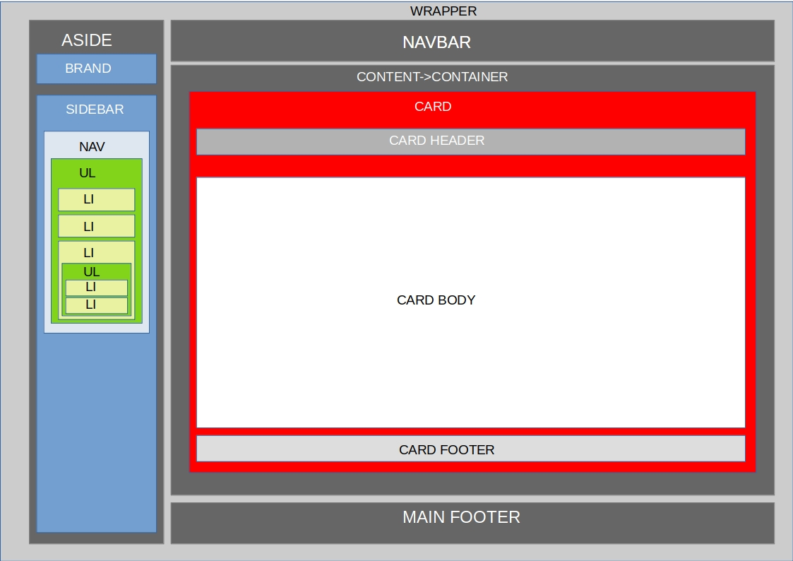
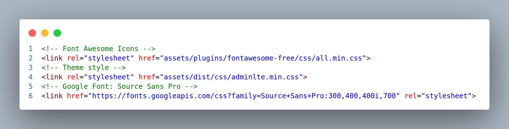
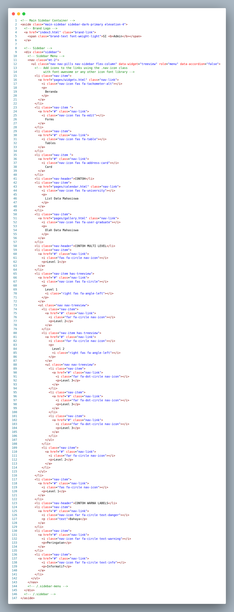
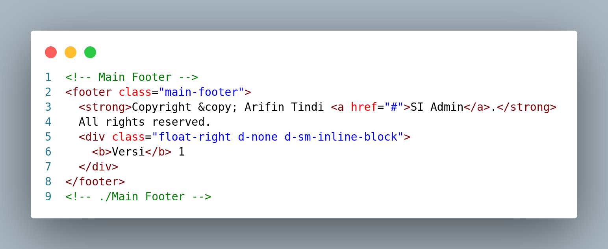
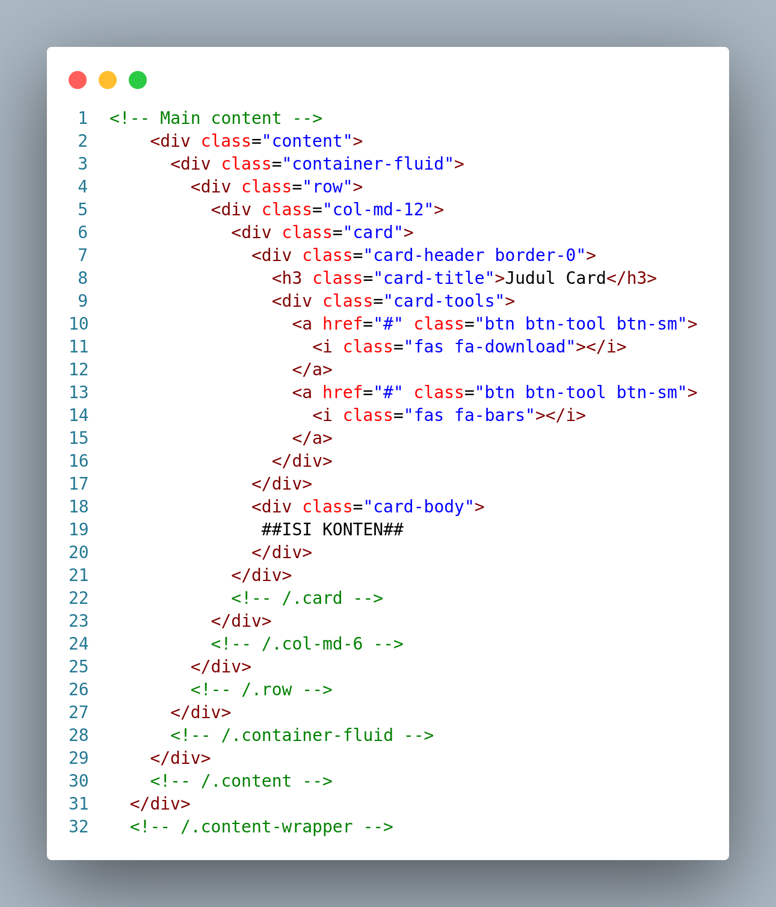
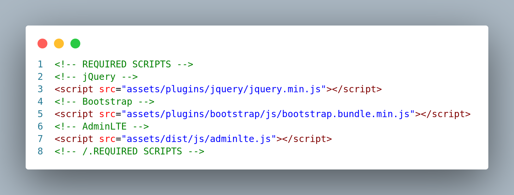
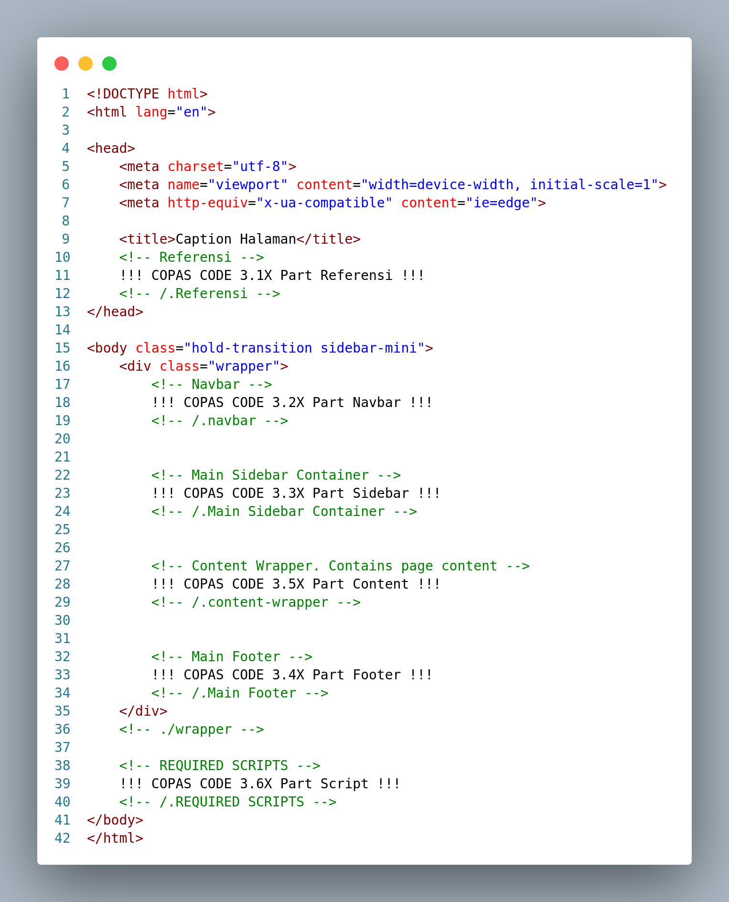
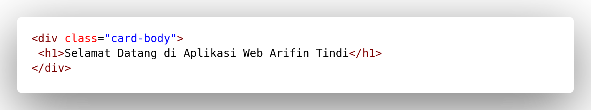
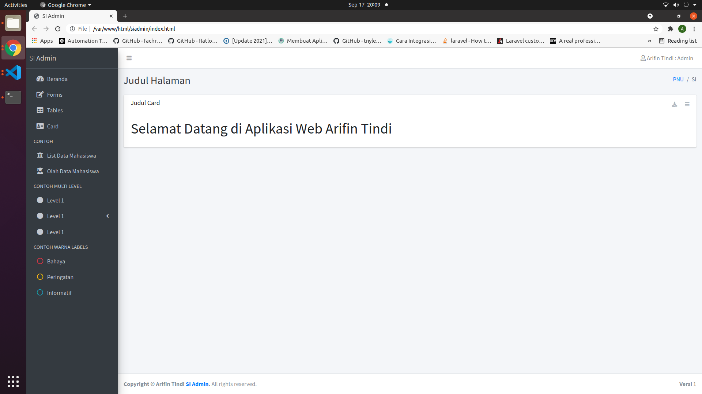
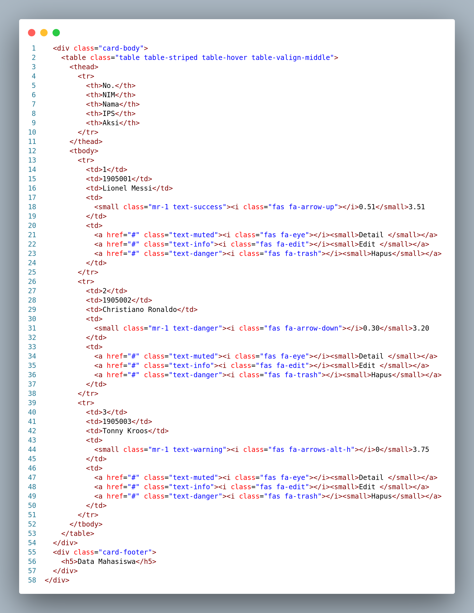

# Design Responsive Admin Panel Dengan HTML 5 dan Bootstrap 4 (Front End Developer)

#### Sebagai Hand On Lab untuk Kuliah Pemrograman Web pada Program Studi Sistem Informasi Polnustar

2021 🚀️ author https://github.com/arpaulustindi

# BAGIAN >> Materi

1. Konsep HTML
2. Blueprint Admin Panel
3. Layout

## 1. Konsep HTML

Berikut merupakan hirarki HTML dasar

* HTML
  * HEAD
    * RESPONSIVE OPTION
    * LINK/STYLE
  * BODY
    * LAYOUT WEB

dengan script dasar sebagai berikut

```
<!DOCTYPE html>
<html lang="en">
<head>
    <meta charset="UTF-8"> <!--SETTING ENCODING DEFAULT-->
    <meta http-equiv="X-UA-Compatible" content="IE=edge"> <!--SETTING KOMPABILITAS BROWSER-->
    <meta name="viewport" content="width=device-width, initial-scale=1.0"> <!--SETTING RESPONSIVE LAYOUT-->
    <title>Document</title> <!--CAPTION TAB BROWSER -->
</head>
<body>
  
</body>
</html>
```

## 2. Blueprint Admin Panel

Berikut merupakan konsep layout dari Admin Panel yang akan kita gunakan (berada di dalam tag `<body>BLUEPRINT ADMIN PANEL</body>`)




Dengan susunan hirarki sebagai berikut:

**WRAPPER**

* NAVBAR
* ASIDE
  * BRAND
  * SIDEBAR
    * NAV
      * UL
        * LI (Menu 1 Level 1)
        * LI (Menu 1 Level 1)
        * LI (Sub-Menu 1 Level 1)
          * UL
            * LI (Menu 1 level 2)
            * LI (Menu 2 level 2)
* CONTENT
  * CONTAINER
    * CARD
      * CARD HEADER
      * CARD BODY (inti dari halaman web)
      * CARD FOOTER
* MAIN FOOTER

Sedangkan pseudocode dari tag adalah sebagai berikut

1. WRAPPER

   `<div class="wrapper"> ISI WRAPPER </div>`
2. NAVBAR

   `<nav> ISI NAVBAR </nav>`
3. ASIDE

   ``<aside> ISI ASIDE </aside>``
4. BRAND

   Bebas
5. SIDEBAR

   `<div class="sidebar"> ISI SIDEBAR </div>`
6. NAV

   `<nav> ISI NAV </nav>`
7. UL

   `<ul> ISI UL </ul>`
8. LI

   `<li> ISI LI </li>`
9. CONTENT

   `<div class="content-wrapper"> ISI CONTENT </div>`
10. CONTAINER
    `<div class="container-fluid"> ISI CONTAINER </div>`
11. CARD

    `<div class="card"> ISI CARD </div>`
12. CARD HEADER

    `<div class="card-header"> ISI CARD HEADER </div>`
13. CARD BODY

    `<div class="card-body"> ISI CARD BODY </div>`
14. CARD FOOTER

    `<div class="card-footer"> ISI CARD FOOTER </div>`
15. MAIN FOOTER

    `<footer class="main-footer"> ISI MAIN FOOTER </footer>`

## 3. Referensi Bootstrap

Berikut merupakan referensi Bootstrap sebagai pemahaman dasar Anda

1. Komponen dan opsi untuk meletakkan project Bootstrap Anda, termasuk container, grid system, fleskibilitas media, dan tampilan responsif.
   a. Container (Basic Layout) [https://getbootstrap.com/docs/4.6/layout/overview/](https://)
   b. Grid (Tata Letak) [https://getbootstrap.com/docs/4.6/layout/grid/](https://)
   c. Responsif (Tampilan Responsif) [https://getbootstrap.com/docs/4.6/layout/utilities-for-layout/](https://)
2. Konten
   a. Typography (Penulisan)
   b. Code (Menampilkan style untu penulisan Code / Syntax)
   c. Gambar [https://getbootstrap.com/docs/4.6/content/code/](https://)
   d. Tabel [https://getbootstrap.com/docs/4.6/content/tables/](https://)
   e. Figur (Gambar yang memiliki caption) [https://getbootstrap.com/docs/4.6/content/figures/](https://)
3. Komponen
   a. Alerts (Untuk pemberitahuan/notifikasi) [https://getbootstrap.com/docs/4.6/components/alerts/](https://)
   b. Badge (Stiker notifikasi) [https://getbootstrap.com/docs/4.6/components/badge/](https://)
   c. Button (Tombol) [https://getbootstrap.com/docs/4.6/components/buttons/](https://)
   d. Buttom Gorup (Grup Tombol) [https://getbootstrap.com/docs/4.6/components/button-group/](https://)
   e. Card (Layout Kartu) [https://getbootstrap.com/docs/4.6/components/card/](https://)
   f. Carousel (Slide Show) [https://getbootstrap.com/docs/4.6/components/card/](https://)
   g. Collapse (Menapilkan konten tersembunyi) [https://getbootstrap.com/docs/4.6/components/card/](https://)
   h. Dropdowns (Tombol yang memiliki list) [https://getbootstrap.com/docs/4.6/components/dropdowns/](https://)
   i. Form [https://getbootstrap.com/docs/4.6/components/forms/](https://)
   j. Input Group (Kumpulan Form) [https://getbootstrap.com/docs/4.6/components/input-group/](https://)
   k. Modal (Tampilan di atas layar (seperti message box) [https://getbootstrap.com/docs/4.6/components/modal/](https://)
   l. Nav (Navigasi menu) [https://getbootstrap.com/docs/4.6/components/navs/](https://)
   m. Navbar (Kelompok navigasi menu) [https://getbootstrap.com/docs/4.6/components/navbar/](https://)
   n. Pagination (Untuk membagi data menjadi beberapa halaman) [https://getbootstrap.com/docs/4.6/components/pagination/](https://)
4. Ekstra
   a. JQuery (Library Javascript) [https://api.jquery.com/](https://)
   b. Fontawesome (Penggunaan Icon) [https://fontawesome.com/v5.15/icons](https://)
   c. DataTable (Javascript Tabel) [https://datatables.net/manual/installation](https://)
   d. Leaflet (Library Javascript untuk menampilkan peta) [https://leafletjs.com/](https://)
   d. AdminLTE (Admin Panel) Dokumentasi [https://adminlte.io/docs/3.0/](https://) dan download versi rilis [https://github.com/ColorlibHQ/AdminLTE/archive/refs/tags/v3.1.0.zip](https://)
   e. SweetAlert2 (Library Notifikasi Javascript) [https://sweetalert2.github.io/](https://)
   f. Select2 (Library Select/Combo Box Javascript) [https://select2.org/getting-started/basic-usage](https://)

# BAGIAN >> Tugas

## !!! TUGAS DIKERJAKAN BERTAHAP SESUAI INSTRUKSI & AKAN DIPERIKSA PADA REPOSITORY GITHUB KALIAN DAN HARUS DENGAN TOTAL COMMIT 8 !!! APABILA COMMIT TIDAK SESUAI DINYATAKAN TUGAS GUGUR

## !!! DILARANG KERAS COPY PASTE TUGAS (Kecuali yang Diinstruksikan Di Bawah) KARENA AKAN DIKETAHUI MELALUI GIT LOG !!!

## !!! APABILA PADA GIT LOG DITEMUKAN COPY PASTE, MAKA AKUN GIT YANG MEMBERIKAN CODENYA DICOPY, DIPASTIKAN MENDAPAT NILAI D MK WEB PROGRAMMING !!!

## 1. Download

Silahkan download AdminLTE (Lihat materi 3. Referensi Bootstrap -> 4. Ekstra -> d. AdminLTE : download versi rilis. Setelah didownload kemudian extract file zip tersebut

## 2. Setting Project Folder & Setting Github

2.1 Setting root folder project

Buatlah sebuah folder (baiknya di drive D, sangat disarankan huruf kecil tanpa spasi. Contoh  **D:\web\siadmin** atau **D:\siadmin**. Setelah selesai, buka folder tesebut kemudian di dalamya buatlah folder **assets**

contoh


> folder *siadmin* selanjutnya akan disebut dengan folder **root** web

### 2.2 Setting folder assets

Pada folder hasil ekstraksi, copy folder **dist** & **plugins** ke dalam folder **asset** yang telah dibuat sebelumnya

2.3 Setting Github

Buatlah sebuah **repository github** dengan **nama sesuai dengan nama folder** yang dibuat di atas.

Pastikan Kalian mensetting git pada local folder kalian (lakukan saat ini)

1. `git init`
2. `git remote add origin https://github.com/namauserkalian/namarepositorykalian.git`

Untuk setiap commit (yang akan dilakukan pada langkah-langkah tugas di bawah) pastikan

1. `git add .`
2. `git commit -m "Keterangan Commit Kalian"`
3. `git push origin master` atau `git push origin main` Push dilakukan untuk mengirim project local ke repository kalian

## 3. Coding

silahkan buka code editor yang anda gunakan (VS Code/Sublime/dll) kemudian buka folder root

> Perlu diperhatikan untuk **nomor** pada kode - kode di merupakan nomor baris/line, tidak perlu diketik. Sedangkan untuk tulisan berwarna hijau merupakan  komentar yang berguna sebagai petunjuk. Dalam tahap pembelajaran sebaiknya memakai komentar

### 3.1X Part Referensi

pada root buatlah file dengan nama **referensi.html** dengan kode seperti berikut



> Kemudian **commit** dengan keterangan "*1. Membuat Part Referensi*" setelah itu **push**

### 3.2X Part Navbar

pada root buatlah file dengan nama **navbar.html** dengan kode seperti berikut


> Kemudian **commit** dengan keterangan "*2. Membuat Part Navbar*" setelah itu **push**

### 3.3X Part Sidebar

pada root buatlah file dengan nama **sidebar.html** dengan kode seperti berikut



> Kemudian **commit** dengan keterangan "*3. Membuat Part Sidebar*" setelah itu **push**

### 3.4X Part Footer

pada root buatlah file dengan nama **footer.html** dengan kode seperti berikut (nama silahkan ganti dengan nama kalian)



> Kemudian **commit** dengan keterangan "*4. Membuat Part Footer*" setelah itu **push**

### 3.5X Part Content

pada root buatlah file dengan nama **content.html** dengan kode seperti berikut



> Kemudian **commit** dengan keterangan "*5. Membuat Part Content*" setelah itu **push**

### 3.6X Part Script

pada root buatlah file dengan nama **script.html** dengan kode seperti berikut



> Kemudian **commit** dengan keterangan "*6. Membuat Part Script*" setelah itu **push**

---

### 3.XtoZ KONSEP (Jangan Dulu Koding)

Untuk 3 langkah berikutnya, perhatikan susunanan berikut ini (untuk kode dengan awalan !!! dan akhiran !!! adalah mengcopy paste (COPAS) kode yang telah dibuat pada petunjuk-petunjuk sebelumnya)



### 3.7Z Beranda

pada root buatlah file dengan nama **index.html** dengan susuna seperti konsep **3.XtoZ KONSEP**. Kemudian pada Part Content temukan kode seperti berikut ini


setelah menemukan, kemudian diganti dengan kode berikut ini (untuk nama rubah menjadi nama kalian)



Dan hasilnya dapat dilihat pada broser dengan membuka file index.php dengan browser (disarankan Google Chrome) maka hasilnya sebagai berikut



> Kemudian **commit** dengan keterangan "*7. Membuat Beranda*" setelah itu **push**

### 3.8Z List Data

pada root buatlah file dengan nama **list.html** dengan susuna seperti konsep **3.XtoZ KONSEP**. Kemudian pada Part Content temukan kode seperti berikut ini


setelah menemukan, kemudian diganti dengan kode berikut ini (pada coding di bawah ini, abaikan ~~Nomor Baris~~, sesuaikan dengan tag `<div class="card-body"> </div>` kalian



Dan hasilnya dapat dilihat pada browser dengan membuka file index.php dengan browser (disarankan Google Chrome) maka hasilnya sebagai berikut


> Kemudian **commit** dengan keterangan "*8. Membuat Beranda*" setelah itu **push**

### 3.9Z To be continue ...
